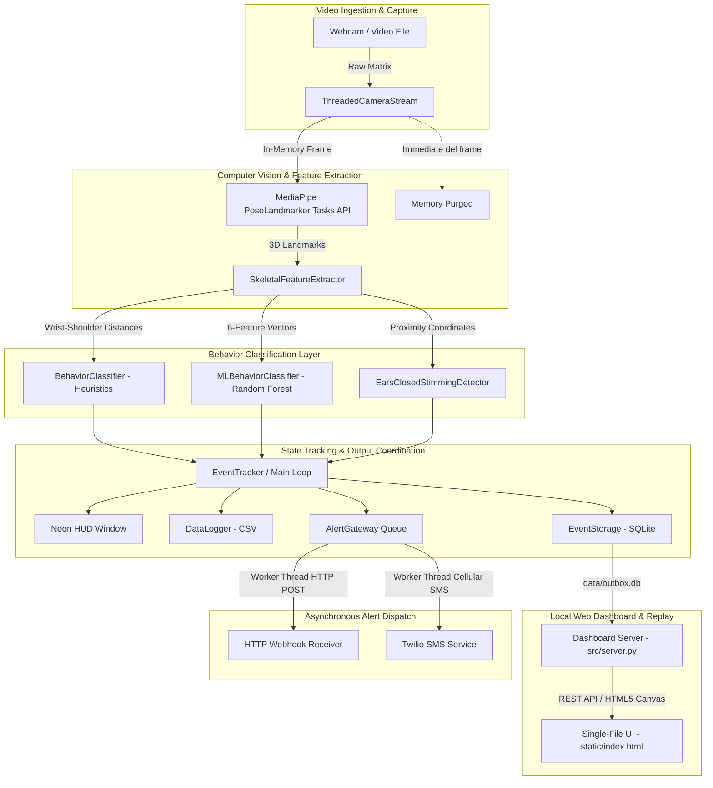
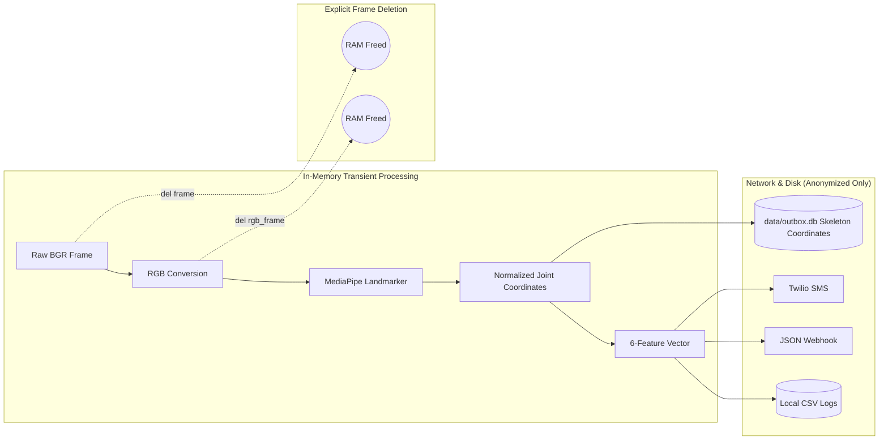

# Architecture

**Autism Activity Monitoring & Alerting System (AAMAS)**

This document describes the implemented system architecture — components, data flow, thread model, metrics, and verification outcomes for the standalone local AAMAS edge monitor and video ingestion tool. For product scope and vision see [product-scope.md](product-scope.md); for setup and developer workflow see [development.md](development.md); for the test protocol see [test_plan.md](test_plan.md).

---

## 1. Executive Summary & Quality Benchmarks

AAMAS is engineered as a decoupled, multi-threaded computer vision pipeline executing entirely on local edge hardware. It delivers real-time detection of **three distinct behavioral states** — Normal, Stimming (rhythmic motion), and Physical Avoidance (covering ears, closing eyes) — alongside a dedicated ears-closed stimming subtype, without saving raw video to disk or sending video over networks.

### Core Metrics Dashboard
*   **System Throughput:** Balanced at **`28.0 - 29.5 FPS`** on Apple M-series Silicon (target $\ge 30\text{ FPS}$, minimum constraint $\ge 15\text{ FPS}$).
*   **Classifier Computation Overhead:** Extremely lean **`0.1 ms`** per frame for Heuristics, and **`1.1 ms`** for Random Forest ML inference.
*   **Alert Queuing Overhead:** **`0.0 ms`** impact on the core vision loop due to background worker thread offloading.
*   **Pipeline Latency:** **`1.0s` to `1.5s`** elapsed from sustained behavior onset to background webhook/SMS dispatch.
*   **Avoidance Detection Latency:** **`~1.0s`** (30 frames for Ears Covered) and **`~1.5s`** (45 frames for Eyes Closed) from onset to alert.
*   **Resource Stability:** Flat memory footprint over multi-hour profiling runs ($\pm 0\text{ MB}$ variation).
*   **Privacy Compliance:** **100% compliant**. Zero local image/video storage and zero PII transmitted over network channels.
*   **Behavioral Classes Detected:** **3** — Normal (Label 0), Stimming (Label 1), Physical Avoidance (Label 2).
*   **Notification Channels:** **2** — Anonymized JSON HTTP Webhooks & Direct Caregiver SMS (via Twilio).

---

## 2. Technical Architecture & Component Breakdown

All components below execute locally on the edge device. Outbound data consists exclusively of anonymized event metadata via the alerting gateway (webhook/SMS).

### Component Details

1. **Threaded Camera Stream (`src/camera_stream.py`):**
   - Decouples hardware-level frame acquisition (OpenCV `VideoCapture`) from the main processing loop into a persistent background thread.
   - Continuously stores the latest frame into a thread-safe buffer, dropping frame retrieval latency to $< 0.1\text{ ms}$.
   - Handles EOF gracefully when reading video files.

2. **Scale-Invariant Feature Extraction (`src/feature_extractor.py`):**
   - Utilizes Google MediaPipe Tasks API (`PoseLandmarker`) to detect 33 3D skeletal landmarks.
   - Computes four normalized geometric metrics:
     1. **Wrist-to-Shoulder Distance** (`wrist_shoulder_dist`): Normalized by inter-shoulder distance to achieve distance-invariance; tracks hand-flapping and arm oscillations.
     2. **Wrist-to-Ear Distance** (`ear_coverage_dist`): Normalized proximity of wrists to respective ears; tracks covering ears.
     3. **Eye Openness Ratio** (`eye_openness_ratio`): Vertical eyelid distance normalized by inter-eye distance; tracks eye closure.
     4. **Simulation Overrides** (`simulated_ears_covered`, `simulated_eyes_closed`): For keyboard-driven test scenarios.

3. **Rule-Based Heuristic Engine (`src/classifier.py`):**
   - Evaluates rolling sequence buffers using a peak-counting mathematical rhythm checker to detect cyclical motions ($3.0\text{ Hz} - 6.5\text{ Hz}$, mean velocity $> 0.04$, distance std $> 0.01$).
   - Stimming triggers when the activation ratio reaches **50%** over a **3.0-second** sliding window.
   - Evaluates sustained avoidance:
     - **Ears Covered:** `ear_coverage_dist < 0.15` sustained for 30 consecutive frames (~1.0s at 30 FPS).
     - **Eyes Closed:** `eye_openness_ratio < 0.20` sustained for 45 consecutive frames (~1.5s at 30 FPS).

4. **Ears-Closed Stimming Detector (`src/ears_closed_stimming.py`):**
   - Dedicated detector firing when both hands are near ears *and* eyes are closed simultaneously, sustained for $\ge 2.0\text{ seconds}$ (60 frames at 30 FPS).
   - Emits structured event properties (`category: stimming`, `subtype: ears_closed_stimming`, `action: both_hands_on_ears`) surfaced on the HUD.

5. **Machine Learning Classifier Layer (`src/ml_classifier.py`):**
   - Implements a scikit-learn Random Forest Classifier (100 estimators, max depth 6; trained in `train_classifier.py`).
   - Evaluates a 6-feature vector: `mean_distance`, `std_distance`, `mean_velocity`, `peak_frequency`, `mean_ear_coverage`, `mean_eye_openness`.
   - Per-frame predictions (Normal=0, Stimming=1, Avoidance=2) are smoothed over a 3.0-second sliding window ($\ge 60\%$ majority threshold).
   - Automatically falls back to the heuristic engine if no model file is present.

6. **Local SQLite Event Storage (`src/event_storage.py`):**
   - Persists behavior episodes and downsampled skeleton snapshots (11 joint coordinates at 10 FPS) in `data/outbox.db`.
   - Supports query filtering by date, time range, behavior type, and source.

7. **Standalone Dashboard Server (`src/server.py` & `static/index.html`):**
   - Lightweight built-in Python HTTP server (`http.server.ThreadingHTTPServer`) serving the single-file UI and REST API (`/api/stats`, `/api/episodes`, `/api/episodes/<id>`).
   - HTML5 canvas player rendering animated skeleton coordinate replays with scrub, loop, and step-frame controls.

8. **Local Data Logger (`src/data_logger.py`):**
   - Appends 9-column feature records to `data/behavior_log.csv` for dataset collection and model training: `timestamp`, `mean_distance`, `std_distance`, `mean_velocity`, `peak_frequency`, `mean_ear_coverage`, `mean_eye_openness`, `ear_coverage_dist`, `eye_openness_ratio`, and `label`.

9. **Asynchronous Alert Gateway (`src/alert_gateway.py`):**
   - Employs a thread-safe `queue.Queue` and a dedicated worker daemon thread to process alerts asynchronously without blocking video processing.
   - Dispatches JSON HTTP POST webhooks to the configured `WEBHOOK_URL`.
   - Dispatches SMS notifications via Twilio when `ENABLE_MOBILE_NOTIFICATIONS=true` and valid credentials are provided. Gracefully logs warnings and falls back if credentials are unconfigured.

10. **Shared Pipeline Event Tracker (`src/pipeline.py`):**
    - Provides a unified `EventTracker` state machine for tracking behavior start and resolution edges (`stimming_start`, `stimming_resolved`, `avoidance_start`, `avoidance_resolved`, `ears_closed_stimming_start`, `ears_closed_stimming_resolved`).
    - Shared between the live monitor loop (`src/main.py`) and recorded video ingestion CLI (`src/ingest.py`).

11. **Main Monitor Loop (`src/main.py`):**
    - Orchestrates video capture, feature extraction, classification, HUD rendering, SQLite episode persistence, CSV logging, and alert triggering.
    - Provides interactive keyboard controls:
      - `q`: Quit gracefully.
      - `n` / `s` / `a`: Log live frame as Normal (0), Stimming (1), or Avoidance (2).
      - `c` / `e`: Simulate covering ears or closing eyes.

12. **Recorded Video Ingest CLI (`src/ingest.py`):**
    - Headless command-line tool for analyzing single video files or full directories (`samples/`).
    - Feeds frames through the shared feature extractor and event tracker, buffering skeleton snapshots, writing episodes to `data/outbox.db`, logging frame data to CSV, and dispatching alerts.

---

## 3. Privacy & Memory Architecture

- **Immediate Frame Deletion:** `del frame` and `del overlay` calls are executed within each iteration to force instant garbage collection.
- **Zero Video Disk Storage:** No intermediate video recordings, pixel arrays, or facial imagery are ever stored to disk or transmitted over networks.
- **Privacy-Preserving Replays:** Only 11 normalized floating-point joint coordinates are saved for visual motion replay.
- **Payload Anonymization:** Webhook and SMS messages contain only event identifiers, duration, and metric aggregates.

---

## 4. Verification Summary

All components are covered by a suite of 45 automated tests across 10 test modules:
- `tests/test_feature_extractor.py`: Scale-invariant normalization, ear coverage, eye openness, simulation overrides.
- `tests/test_classifier.py`: Peak-counting frequency math, threshold triggers, activation window resizing.
- `tests/test_ml_classifier.py`: Heuristic fallback, output schema parity, activation window resizing.
- `tests/test_ears_closed_stimming.py`: Multi-signal sustained detection.
- `tests/test_camera_stream.py`: Non-blocking frame cache and EOF recovery.
- `tests/test_alert_gateway.py`: Asynchronous queue dispatch, webhook payload formatting, connection error resilience, Twilio SMS routing, and graceful fallback.
- `tests/test_pipeline.py`: Shared `EventTracker` transitions, duration calculation, and independent behavior handling.
- `tests/test_event_storage.py`: SQLite episode/snapshot persistence, queries, filtering, and downsampled snapshot extraction.
- `tests/test_server.py`: REST API endpoints (`/api/stats`, `/api/episodes`, `/api/episodes/<id>`) and dashboard HTML serving.
- `tests/test_ingest.py`: Video file and directory batch ingestion, local SQLite storage, CSV logging, and alert dispatch.
