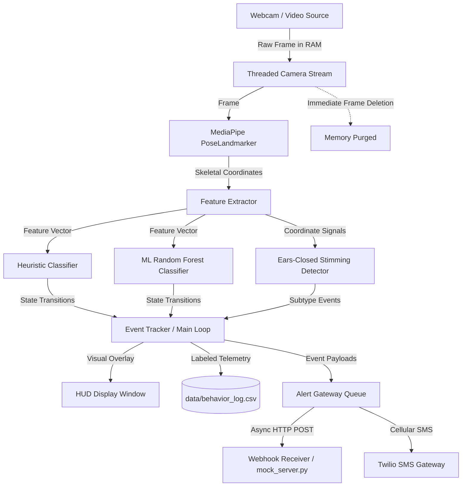

# Product Scope

**Autism Activity Monitoring & Alerting System (AAMAS)**

This document defines *what* AAMAS is and *why* — its vision, target users, capabilities, system architecture, privacy-by-design model, and success criteria as a lightweight, self-contained local edge monitor and video ingestion tool. For technical implementation and component details see [architecture.md](architecture.md); for setup and developer workflow see [development.md](development.md); for the test protocol see [test_plan.md](test_plan.md).

---

## Table of Contents

- [1. Vision](#1-vision)
- [2. Product Goals](#2-product-goals)
- [3. Target Users & Personas](#3-target-users--personas)
- [4. Core Use Cases](#4-core-use-cases)
- [5. System Scope](#5-system-scope)
  - [5.1 In Scope](#51-in-scope)
  - [5.2 Out of Scope / Non-Goals](#52-out-of-scope--non-goals)
- [6. System Architecture & Data Flow](#6-system-architecture--data-flow)
- [7. Privacy-by-Design Principles](#7-privacy-by-design-principles)
- [8. Technical Stack](#8-technical-stack)
- [9. Success Criteria & Benchmarks](#9-success-criteria--benchmarks)
- [10. Future Roadmap](#10-future-roadmap)

---

## 1. Vision

AAMAS empowers caregivers and support professionals to monitor and respond to behavioral patterns in real time by detecting self-stimulatory (stimming) and physical avoidance behaviors — **without compromising user privacy and without ever transmitting raw video frames across external networks**.

Operating completely on local edge hardware, AAMAS processes camera streams and pre-recorded video files entirely in memory, extracts scale-invariant skeletal landmarks, classifies behavioral states, logs metrics locally, and dispatches real-time alerts via Webhooks and optional SMS notifications.

---

## 2. Product Goals

- **Accurate On-Device Detection:** Detect self-stimulatory behaviors (e.g. rhythmic hand-flapping, rocking) and physical avoidance behaviors (covering ears, closing eyes, and the combined ears-closed stimming subtype) using local computer vision.
- **Immediate Alerting:** Notify caregivers when behaviors exceed predefined duration and frequency thresholds via non-blocking local webhooks and direct SMS.
- **Strict Privacy by Design:** Guarantee that raw video frames and skeletal landmarks remain strictly in local RAM and are purged immediately after processing.
- **Local Data Logging:** Record numeric behavioral feature vectors to local CSV files (`data/behavior_log.csv`) for analysis and ML model training.
- **High Performance on Edge Hardware:** Maintain sustained ~30 FPS throughput on standard consumer hardware with minimal CPU/memory overhead.
- **Dual Operating Modes:** Support real-time live webcam monitoring with an interactive HUD as well as headless batch processing of pre-recorded video files.

---

## 3. Target Users & Personas

| Persona | Description | Primary Needs |
| :--- | :--- | :--- |
| **Caregiver / Parent** | An individual caring for someone exhibiting stimming or sensory avoidance behaviors. | Immediate alerts when sustained behaviors occur; clear visual HUD when monitoring live; local privacy assurance. |
| **Special Education / Aide** | A support professional or therapist reviewing recorded sessions or monitoring classroom environments. | Offline video file analysis; batch processing; exportable local CSV telemetry for behavioral analysis. |
| **System Integrator / Developer** | A developer deploying edge devices or integrating AAMAS with home automation / local servers. | Lightweight standalone Python deployment; simple `.env` configuration; JSON webhook payloads; clean CLI tooling. |

---

## 4. Core Use Cases

1. **Live Edge Monitoring with Visual HUD:** A caregiver runs AAMAS with a webcam. The application overlays real-time metrics and state indicators on the video display. When stimming or avoidance occurs for a sustained duration, AAMAS triggers alerts and updates the HUD border and banner.
2. **Headless Background Monitoring:** An edge device runs AAMAS without a display window (`--headless`). Detection runs continuously in the background, dispatching webhooks to a local server or home automation system.
3. **Offline Video Ingestion:** A therapist analyzes recorded video footage via the CLI (`python -m src.ingest samples/`). AAMAS processes the video at high speed, logs skeletal telemetry to CSV, and dispatches alert events for detected episodes.
4. **Machine Learning Model Training:** A practitioner uses keyboard shortcuts (`n`, `s`, `a`) during monitoring to label live data, saving feature rows to `data/behavior_log.csv`, and trains a custom Random Forest classifier using `train_classifier.py`.

---

## 5. System Scope

### 5.1 In Scope

1. **Live Camera Capture & HUD Overlay:** Decoupled multi-threaded camera acquisition supporting webcams and video streams with neon visual feedback.
2. **MediaPipe Landmark Extraction:** 3D skeletal landmark extraction using the modern MediaPipe Tasks API (`PoseLandmarker`).
3. **Dual Classification Engines:**
   - **Rule-Based Heuristic Engine:** FFT peak-counting frequency analysis ($3.0\text{ Hz} - 6.5\text{ Hz}$), velocity tracking, and avoidance geometry thresholds.
   - **Machine Learning Engine:** 6-feature scikit-learn Random Forest classifier with sliding-window smoothing and automatic heuristic fallback.
4. **Ears-Closed Stimming Detector:** Specialized detector identifying simultaneous ear coverage and eye closure sustained for $\ge 2.0\text{ seconds}$.
5. **Multi-Channel Alert Gateway:** Asynchronous background worker queue dispatching JSON HTTP Webhooks and Twilio SMS text alerts.
6. **Local Data Logger:** 9-column CSV logger for recording labeled feature vectors for model retraining.
7. **Offline Video Ingestion CLI:** Single-file and directory-batch headless video ingestion.

### 5.2 Out of Scope / Non-Goals

- **Cloud Backends & Multi-User Dashboards:** AAMAS is purely a standalone local tool; centralized cloud sync and web interfaces are excluded.
- **Multi-Person Tracking:** Designed for single-subject monitoring per camera/agent.
- **Raw Video Storage / Cloud Streaming:** No raw visual frames or clips are stored to disk or transmitted across networks.
- **Clinical / Diagnostic Certification:** AAMAS is an assistive engineering tool, not a certified medical or diagnostic device.

---

## 6. System Architecture & Data Flow

---

## 7. Privacy-by-Design Principles

1. **Zero Persistent Imagery:** Video frames exist exclusively in RAM during processing and are immediately purged (`del frame`) on every loop iteration.
2. **Local Processing Only:** Skeletal extraction and classification run 100% on the local CPU/GPU; no visual telemetry leaves the host machine.
3. **Anonymized Alert Payloads:** Outbound webhook and SMS notifications contain only event metadata (behavior type, timestamp, duration, intensity metrics) — zero PII or visual data.
4. **Offline Resilience:** All detection, logging, and video ingestion functionality operates entirely without internet access (with the exception of optional Twilio SMS dispatch).

---

## 8. Technical Stack

- **Language:** Python 3.10+ (tested on Python 3.11)
- **Computer Vision & ML:** OpenCV (`opencv-python`), Google MediaPipe (`mediapipe`), NumPy (`numpy`), scikit-learn (`scikit-learn`)
- **Alerting & Communications:** Requests (`requests`), Twilio Python SDK (`twilio`), Python-dotenv (`python-dotenv`)
- **Testing & Quality:** Pytest (`pytest`, `pytest-mock`), Ruff (`ruff`)

---

## 9. Success Criteria & Benchmarks

- **Throughput:** Sustained $\ge 28\text{ FPS}$ on modern consumer hardware.
- **Classifier Latency:** $\le 0.1\text{ ms}$ for Heuristics, $\le 1.5\text{ ms}$ for Random Forest inference.
- **Alert Latency:** $\le 1.5\text{ seconds}$ from sustained behavior onset to webhook dispatch.
- **Memory Stability:** Flat memory footprint over multi-hour runs ($\pm 0\text{ MB}$ variation).
- **Test Suite Integrity:** 100% pass rate across all automated unit and integration tests.

---

## 10. Future Roadmap

- **Expanded Behavior Library:** Additional detector modules for repetitive head nodding, pacing, and hand-wringing.
- **Edge Acceleration:** Optimization for embedded hardware such as Raspberry Pi 5 and NVIDIA Jetson Nano.
- **Real-World Calibration:** Model retraining and parameter tuning based on validated clinical datasets.
