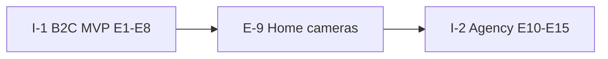

# ATMON Product & Technical Backlog

> Navigation: [Docs Index](../README.md) / [Sprint Tracker](SPRINT_TRACKER.md) / **Backlog**  
> Scoring source: [ASSESSMENT.md](ASSESSMENT.md)

Sequencing (from product backlog): **mobile capture first** → home cameras → agency platform.

---

## Initiative roadmap

| Initiative | Epics | Status |
|---|---|---|
| I-1 B2C-MVP | E-1…E-8 | Core loop done; hardening in Sprints 1–6 |
| I-1 Phase 2 | E-9 | Deferred |
| I-2 B2B-Phase3 | E-10…E-15 | Deferred (needs detailing pass) |

---

## Epic status (B2C)

| Epic | Title | Status | Pilot sprints |
|---|---|---|---|
| E-1 | Mobile Capture | Mostly done | S3 (battery/storage) |
| E-2 | Behavior Perception | Detect core done | S3–S4 |
| E-3 | Behavior Log & Index | Mostly done | S2 (clips), S3 (trends) |
| E-4 | Clinician Sharing | Mostly done | S2 (export), S4 (identity) |
| E-5 | Consent / Assent | Scaffolding | S1–S2, S4–S5 |
| E-6 | Retention / Storage | Partial | S1 |
| E-7 | Accounts / Privacy | Foundation | S1, S4 |
| E-8 | Onboarding / Trust / Monetization | Early | S1–S2, S5; billing deferred |
| E-9 | Home Cameras | Not started | Deferred |
| E-10…E-15 | Agency | Not started | Deferred |

---

## Active delivery (Sprints 1–6)

| Sprint | Outcome | Pts (est.) |
|---|---|---|
| [1](sprint-01/PROMPT.md) | Pilot blockers: household, export/delete, retention | 31 |
| [2](sprint-02/PROMPT.md) | Trust, assent, clinical export, clip share | 24 |
| [3](sprint-03/PROMPT.md) | Detect quality loop + vocal spike | 24 |
| [4](sprint-04/PROMPT.md) | Compliance & clinician identity | 29 |
| [5](sprint-05/PROMPT.md) | Instrumentation & resilience | 18 |
| [6](sprint-06/PROMPT.md) | Pilot polish & freeze | 18 |

---

## Explicitly deferred

| Item | Why |
|---|---|
| E-9 Home cameras | Phase 2 after mobile pilot |
| F-2.6 Multi-subject attribution | Agency problem |
| F-7.9 Dual / split household | Custody complexity |
| F-7.2 Encryption / US residency productization | Infra track |
| F-8.2 Subscription & billing | Open product decision |
| E-10…E-15 Agency | Detailing pass required |
| True on-device ML (full F-1.2) | Local `:8010` OK for pilot |
